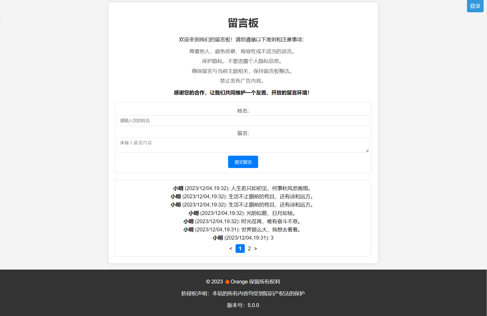
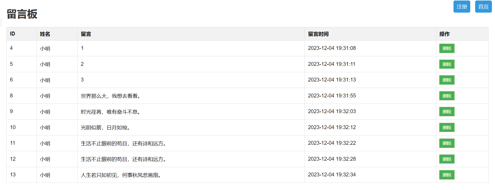

### 简介

此为个人项目-留言板网页系统

功能只有留言功能和增加删除功能,和一个简单的后台管理来进行删除留言的信息.

此项目可运用的场景广泛,可以发挥想象力兼容自己的博客等

第一次开发,目前项目版本5.0,bug居多,多多谅解,此程序仅供参考

### 环境

- PHP 版本:8.0
- 面板:宝塔面板
- 系统:CentOS 8.5.2111 x86_64(Py3.7.9)
- MySQL:5.7.40
- Nginx:1.22.1

### 安装注意事项

1. 下载源码,上线部署即可,环境必须包括有数据库和Nginx或者是Apache和PHP,其他未进行测试.
2. 在本地虚拟机搭建宝塔面板测试.
3. 你需要修改一些地方才能正常运行:
   秘钥是注册的唯一要求:在php/register_backend.php中的$fixedKey = "admin"; (admin)即是你注册的秘钥.
4. 修改各个数据库连接的信息:

```php
$servername = "localhost";
$username = "test2_top";
$password = "test2_top";
$dbname = "test2_top";
```

5. 修改test2_top为你的数据库信息（替换为您自己的数据库信息）,修改全部.php后缀文件.

6. 可选:选择性导入数据库信息,数据库信息包含了已注册的账号(账号:admin/密码:admin)和几条留言信息作为测试.

### 已知问题

注册成功后不会自动跳转到后台管理页面

### 效果图




